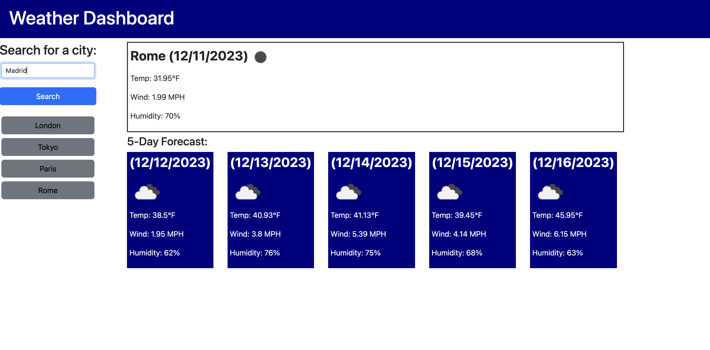

# Weather Dashboard

## Description

This weather dashboard was created to learn how to use third party APIs in JavaScript. This application provides current weather and a five-day forecast of any city the user searches. It taught me how to properly implement an API key, send a fetch request, retrieve and traverse data objects from an API, and create dynamic query parameters with variables. I also practiced the use of jQuery, template literals, local storage, using a CSS framework (Bootstrap) and more. 

## Installation

To deploy the weather dashboard, visit the project repository on GitHub > Settings > Pages > Source > Branch (main) > Save. From here you can view the finished project on GitHub Pages. You can view it via GitHub Pages here:

## Usage

To use this weather dashboard, begin by typing in a city into the search bar. Click the search button or press the enter key. From there, the current weather of the city will appear, including date, an icon of current weather, temperature, wind speed and humidity. Additionally, the five day forecast will appear. City searches will be saved to the search history through local storage. Users can click the button with a city in search history to see that weather again.

## Credits

OpenWeather API: https://openweathermap.org/api

Bootstrap: https://getbootstrap.com/docs/5.3/getting-started/introduction/

## License

n/a